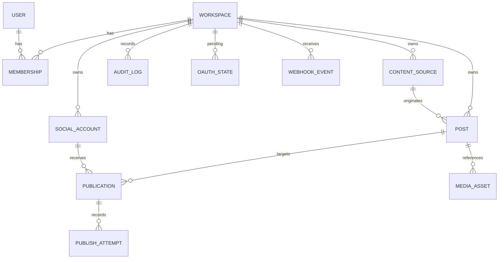

# Postelyo – Domain Model

Status: **Proposed – awaiting approval for Phase 1 (implementation)**
Created: 2026-09-21 · Updated: 2026-09-22 (product decisions P1–P9 incorporated)
Related: [architecture.md](./architecture.md) §3, §7, §9

Conventions: all ids are UUIDv7 (time-ordered); all timestamps `timestamptz`; every tenant-owned table has `workspace_id` as the first column of its main indexes; soft delete only where stated; `created_at`/`updated_at` on every table (omitted below for brevity).

---

## 1. Entity overview



Aggregate roots: `Workspace`, `Post` (with its `Publication`s and `PublishAttempt`s), `SocialAccount`, `ContentSource`. Cross-aggregate references are by id only.

---

## 2. Tables

### 2.1 `workspace`

| Column | Type | Notes |
|--------|------|-------|
| id | uuid PK | |
| slug | text UNIQUE | URL-safe |
| name | text | |
| default_timezone | text | IANA, required (e.g. `Europe/Berlin`) |
| default_publish_time | time | Local wall-clock used when a source date has no time (default 09:00) |
| plan | text | `free`, `solo`, `team`, `agency`. With a `subscription` row Stripe's state is synced here; without one the column is the source of truth (operator-granted plans) |
| settings | jsonb | Small, versioned bag: `dailyCapPerAccount`, `notionWebhooks`, `providers.{x,facebook,instagram}`, Phase 3 `notificationEmail` (account notices) and `alertCopyEmail` (copy of alerts) |
| deleted_at | timestamptz null | Soft delete (Phase 3): hidden from members and the tenancy guard at once; the `workspace-delete` job purges the row, cascading every tenant table |

### 2.2 `user`

| Column | Type | Notes |
|--------|------|-------|
| id | uuid PK | |
| email | citext UNIQUE | |
| name | text null | |
| Auth-library tables (`session`, `verification`, `account`) are owned by Better Auth and reference `user.id`. |

### 2.3 `membership`

| Column | Type | Notes |
|--------|------|-------|
| id | uuid PK | |
| workspace_id | uuid FK | |
| user_id | uuid FK | |
| role | enum `owner, admin, editor, viewer` | MVP uses owner/admin |
| UNIQUE (workspace_id, user_id) | | |

### 2.4 `content_source`

A connected authoring system. MVP: exactly one per workspace, kind `notion`.

| Column | Type | Notes |
|--------|------|-------|
| id | uuid PK | |
| workspace_id | uuid FK | |
| kind | enum `notion, native` | `native` reserved |
| status | enum `active, error, disabled` | |
| credential_enc | bytea | Envelope-encrypted Notion token (see [security.md](./security.md)) |
| credential_key_id | text | Which master key encrypted the DEK |
| external_database_id | text null | Notion database id (dashed uuid); null for `native` |
| external_database_title | text null | Display name captured at connect time |
| config | jsonb | Non-secret settings: `{ "propertyMap": {...}, "warnings": [...], "pollIntervalSeconds": 60 }`; Phase 3 adds `authKind` (`oauth`/`token`), `notionBotId`, `notionWorkspaceId`, `notionWorkspaceName`, `duplicatedTemplateId`, `setupPending`, `setupMode` |
| cursor | jsonb | `{ "last_edited_after": "2026-09-21T10:00:00Z" }` incremental polling cursor |
| last_sync_at | timestamptz null | |
| last_error | text null | Sanitized, never contains secrets |
| UNIQUE (workspace_id, kind, external_database_id) | | Prevents double-connecting the same database |

### 2.5 `social_account`

| Column | Type | Notes |
|--------|------|-------|
| id | uuid PK | |
| workspace_id | uuid FK | |
| provider | enum `linkedin, x, instagram, facebook` | |
| account_type | text | `member` (LinkedIn profile, X profile), `organization` (LinkedIn Page), `page` (Facebook Page), `business` (Instagram professional account). Any number per provider (Phase 2). |
| parent_account_id | uuid null | Instagram accounts reference the Facebook Page whose token they use; disconnecting the parent disconnects them (Phase 2) |
| metadata | jsonb | Non-secret provider details (username, vanity name) |
| provider_account_id | text | e.g. LinkedIn person/organization id (URN suffix) |
| display_name | text | Shown in UI and Notion notes |
| avatar_url | text null | |
| status | enum `active, needs_reauth, revoked, disabled` | Gates publishing |
| scopes | text[] | Granted scopes |
| access_token_enc | bytea null | Envelope-encrypted |
| refresh_token_enc | bytea null | Envelope-encrypted, nullable (LinkedIn usually none) |
| credential_key_id | text null | |
| token_expires_at | timestamptz null | Drives reminders |
| connected_by_user_id | uuid FK | |
| last_used_at | timestamptz null | |
| disconnected_at | timestamptz null | Row kept for audit; tokens wiped |
| UNIQUE (workspace_id, provider, provider_account_id) | | |

### 2.6 `post`

Canonical content record. Source-agnostic; the Notion adapter maps *into* this shape.

| Column | Type | Notes |
|--------|------|-------|
| id | uuid PK | |
| workspace_id | uuid FK | |
| content_source_id | uuid FK null | Null for future native posts |
| external_id | text null | Notion page id |
| external_url | text null | |
| title | text | |
| state | enum (see §3.1) | Editorial states mirrored from the source; derived for scheduled+; stored for querying |
| source_status | text null | Raw status value last observed in the source (e.g. Notion `In review`); drives the mirror and the `post.source_status_observed` audit event |
| content | jsonb | **Snapshot** in canonical format (§4) taken at schedule time |
| content_hash | text | sha256 of `content`; drift detection |
| source_edited_at | timestamptz null | `last_edited_time` from Notion at snapshot |
| requested_platforms | text[] | From the source's `Platforms` property |
| requested_publish_local | text null | Raw local wall-clock string as the user entered it (`2026-10-01T09:00`) |
| requested_timezone | text null | Resolved IANA name |
| validation_errors | jsonb null | `[{ "code": "TEXT_TOO_LONG", "message": "...", "target": "linkedin" }]` |
| warnings | jsonb | Non-blocking notes surfaced to the source: DST adjustment, default time used, content drift, degraded blocks |
| cycle_no | int default 0 | Incremented on each manual re-schedule after failure |
| deleted_at | timestamptz null | Source page archived/deleted |
| UNIQUE (content_source_id, external_id) | | Sync idempotency |
| INDEX (workspace_id, state) | | |

### 2.7 `publication`

One post × one social account. **Unit of scheduling, publishing, retry, idempotency.**

| Column | Type | Notes |
|--------|------|-------|
| id | uuid PK | Also the `Postelyo ID` written to Notion |
| workspace_id | uuid FK | |
| post_id | uuid FK | |
| social_account_id | uuid FK | |
| provider | enum | Denormalized for querying/metrics |
| state | enum (see §3.2) | |
| scheduled_at | timestamptz | UTC instant |
| scheduled_tz | text | IANA |
| scheduled_local | text | Wall-clock intended by the user |
| content_override | jsonb null | Reserved for AI/manual per-platform adaptation (future) |
| cycle_no | int | Mirrors `post.cycle_no` at the time of scheduling |
| attempt_no | int default 0 | Within the current cycle |
| max_attempts | int default 5 | |
| next_attempt_at | timestamptz null | For `retry_wait` |
| queued_at / publishing_at / published_at / failed_at | timestamptz null | Timeline |
| delay_seconds | int null | `published_at − scheduled_at`, set on success; > 300 → writeback `Published late` (P3) |
| deferred_until | timestamptz null | Phase 1: a `scheduled` row waits for the account's daily cap to clear; the tick skips it until then (`last_error_code = daily_cap`) |
| reconcile_attempts | int default 0 | Phase 1: automatic checks made while `ambiguous`; capped at 3 |
| lease_owner | text null | Worker instance id |
| lease_expires_at | timestamptz null | |
| provider_post_id | text null | LinkedIn URN |
| provider_post_url | text null | |
| last_error_code | text null | `auth`, `content`, `permission`, `transient`, `rate_limited`, `daily_cap`, `ambiguous`, `ambiguous_resolved`, `other` |
| last_error_message | text null | Sanitized |
| writeback_state | enum `pending, done, failed` | Notion write-back tracking |
| writeback_attempts | int default 0 | |
| UNIQUE (post_id, social_account_id) | | One row per target, ever |
| UNIQUE (social_account_id, provider_post_id) WHERE provider_post_id IS NOT NULL | | Hard duplicate guard |
| INDEX (state, scheduled_at) | | Scheduler scan |
| INDEX (workspace_id, state) | | |

### 2.8 `publish_attempt`

Append-only record of each provider call.

| Column | Type | Notes |
|--------|------|-------|
| id | uuid PK | |
| workspace_id | uuid FK | |
| publication_id | uuid FK | |
| cycle_no, attempt_no | int | |
| started_at | timestamptz | |
| finished_at | timestamptz null | Null = crashed/ambiguous |
| scheduled_at | timestamptz | Copied from the publication at attempt time (original intent) |
| delay_seconds | int null | `finished_at − scheduled_at` for succeeded attempts (P3) |
| outcome | enum `succeeded, failed_retryable, failed_terminal, unknown` | |
| error_code | text null | |
| error_message | text null | Sanitized |
| request_meta | jsonb | Endpoint, api version, correlation id, content hash — **never** tokens or full content |
| response_meta | jsonb null | Status, headers of interest (`x-restli-id`, `retry-after`), truncated body (≤ 4 KB) |
| worker_id | text | |
| INDEX (publication_id, started_at) | | |

### 2.9 `media_asset`

| Column | Type | Notes |
|--------|------|-------|
| id | uuid PK | |
| workspace_id | uuid FK | |
| post_id | uuid FK | |
| media_object_id | uuid FK null | Stored bytes once inspected (Phase 2) |
| source_url | text | Notion file URL (expiring) |
| content_hash | text | sha256 of bytes; idempotent provider upload key |
| mime_type | text | |
| byte_size | int | |
| width, height | int null | |
| provider_refs | jsonb | `{ "linkedin": { ref, contentHash, uploadedAt } }` cached upload results |
| last_error, inspected_at | | Inspection outcome (validation before the scheduled time) |

### 2.9a `media_object` (Phase 2)

| Column | Type | Notes |
|--------|------|-------|
| id | uuid PK | |
| workspace_id | uuid FK | |
| content_hash | text | sha256; one object per workspace and hash |
| storage_key | text | `ws/<workspace>/<hash>.<ext>` in object storage |
| mime_type, byte_size, width, height | | Of the original |
| variants | jsonb | Derived files keyed by spec (`jpeg-min320-w1440-a0.80-1.91`): `{ key, mimeType, width, height, byteSize }` |
| last_referenced_at | timestamptz | Pruned after 7 days without a referencing asset |
| UNIQUE (workspace_id, content_hash) | | |

### 2.10 `audit_log`

Append-only. Partition by month when volume requires.

| Column | Type | Notes |
|--------|------|-------|
| id | uuid PK | |
| workspace_id | uuid FK null | Null for global events (user sign-in) |
| occurred_at | timestamptz | |
| actor_type | enum `user, system, webhook, api_key` | |
| actor_id | text null | user id, job name, webhook source |
| entity_type | text | `post`, `publication`, `social_account`, `content_source`, `workspace`, `membership` |
| entity_id | uuid | |
| event | text | Dotted, versioned vocabulary: `publication.state_changed` (data includes `scheduled_at`, `published_at`, `delay_seconds` on success), `post.source_status_observed` (data: `{ from, to, source }`, every observed Notion status change, enforced or not), `social_account.connected`, `credential.accessed`, `post.snapshot_taken`, `notification.sent` (data: `{ type, recipient_kind }`, never the address), ... |
| from_state / to_state | text null | For transitions |
| correlation_id | text | Ties HTTP request → job → provider call |
| data | jsonb | Event-specific, secret-free, size-limited (≤ 8 KB) |
| INDEX (workspace_id, entity_type, entity_id, occurred_at) | | |
| INDEX (correlation_id) | | |

Rows are never updated or deleted by application code.

### 2.11 `oauth_state`

| Column | Type | Notes |
|--------|------|-------|
| id | uuid PK | The `state` parameter (random 32 bytes hex also acceptable) |
| workspace_id | uuid FK | |
| user_id | uuid FK | |
| provider | enum | |
| pkce_verifier | text null | If the provider supports PKCE |
| account_type | text default `member` | What the flow connects: `member` or `organization` (Phase 1) |
| redirect_to | text | Post-login return path (validated, same-origin) |
| expires_at | timestamptz | 10 minutes |
| consumed_at | timestamptz null | Single use |

### 2.12 `webhook_event` (Phase 1)

| Column | Type | Notes |
|--------|------|-------|
| id | uuid PK | |
| workspace_id | uuid FK null | Set once the event was matched to a content source |
| source | text | `notion`, ... |
| external_event_id | text | Provider id for dedupe |
| event_type | text | e.g. `page.properties_updated` |
| entity_id | text null | Notion page id |
| received_at | timestamptz | Pruned after 7 days |
| payload | jsonb | Raw, size-limited (64 KB) |
| processed_at | timestamptz null | |
| outcome | text null | `enqueued`, `duplicate`, `ignored:<reason>` |
| UNIQUE (source, external_event_id) | | |

### 2.12a `invitation` (Phase 3)

| Column | Type | Notes |
|--------|------|-------|
| id | uuid PK | |
| workspace_id | uuid FK | RLS |
| email | text | Lower-cased |
| role | enum membership role | Granted on accept; admins may grant up to `admin` |
| token_hash | text UNIQUE | SHA-256 of the link token; the token itself is only in the email |
| invited_by_user_id | uuid FK | |
| expires_at | timestamptz | 7 days |
| accepted_at / accepted_by_user_id | null | Set once |
| revoked_at | timestamptz null | |

### 2.12b `billing_customer` (Phase 3)

| Column | Type | Notes |
|--------|------|-------|
| workspace_id | uuid PK FK | One Stripe customer per workspace |
| stripe_customer_id | text UNIQUE | |
| email | text null | As reported by Checkout |

### 2.12c `subscription` (Phase 3)

| Column | Type | Notes |
|--------|------|-------|
| id | uuid PK | |
| workspace_id | uuid FK | RLS |
| stripe_subscription_id | text UNIQUE | Upsert key for webhooks |
| stripe_price_id | text null | Mapped to a plan through `STRIPE_PRICE_*` |
| plan | text | `free` when the price is unknown |
| status | text | Stripe status verbatim (`active`, `trialing`, `past_due`, `canceled`, ...) |
| current_period_end / cancel_at | timestamptz null | Display |
| grace_until | timestamptz null | Set by `invoice.payment_failed` (now + 14 days); cleared by `invoice.paid` |

Effective plan = `plan` while `active`/`trialing`, or while `past_due` before `grace_until`; otherwise `free`. Maintenance syncs expired grace periods into `workspace.plan`.

### 2.12d `stripe_event` (Phase 3)

| Column | Type | Notes |
|--------|------|-------|
| id | text PK | Stripe event id; the insert is the idempotency check |
| type | text | |
| received_at / processed_at | timestamptz | |
| outcome | text null | `customer_linked`, `subscription_active`, `grace_started`, `ignored:<reason>`, `error:<message>` |

### 2.14 `campaign` (Phase 4)

| Column | Type | Notes |
|--------|------|-------|
| id | uuid PK | |
| workspace_id | uuid FK | RLS |
| content_source_id | uuid FK null | |
| external_id | text | Notion page id in the Campaigns database; UNIQUE with `content_source_id` |
| external_url, name, source_status, starts_on, ends_on | | Mirrored from the page |
| summary | jsonb | Last summary written (`scheduled`, `published`, `failed`, `nextPublishAt`, `firstUrl`, `lastUrl`, `posts`) |
| summary_hash, summary_written_at | | Change detection |
| archived_at | timestamptz null | Page archived in Notion |

`post.campaign_id` (FK, set null) links posts.

### 2.15 `approval` (Phase 4)

| Column | Type | Notes |
|--------|------|-------|
| id | uuid PK | |
| workspace_id, post_id | uuid FK | RLS; cascades with the post |
| content_fp | text | Text-only fingerprint the reviewer approved (see `approvalFingerprint`) |
| approved_by_user_id | uuid FK null | |
| approved_at | timestamptz | |
| revoked_at | timestamptz null | |

### 2.16 `short_link` (Phase 4)

| Column | Type | Notes |
|--------|------|-------|
| id | uuid PK | |
| workspace_id | uuid FK | RLS |
| publication_id | uuid FK null | UNIQUE with `target_url`: retries reuse the code |
| code | text UNIQUE | 8 URL-safe characters |
| target_url | text | Destination with UTM parameters applied |
| clicks, last_click_at | | Counted by `/l/{code}` |

### 2.17 Phase 4 columns on existing tables

`post`: `parent_post_id` (source page of a generated instance), `series_key` (UNIQUE per source: `<page>:<date>` or `evergreen:<instant>`), `series_fp` (text fingerprint the instance was generated with), `series_source_hash` (content hash last propagated), `repeat_rule` (`weekly`, `biweekly`, `monthly`, `evergreen`), `repeat_until`, `approval_fp` (fingerprint a reviewer would approve now). `publication`: `first_comment_state` (null, `pending`, `posting`, `posted`, `failed`), `first_comment_id`, `first_comment_error`, `first_comment_attempts`. `workspace.settings` gains `links`, `evergreen`, `approval`.

### 2.18 `publication_metric` (Phase 5)

| Column | Type | Notes |
|--------|------|-------|
| id | uuid PK | |
| workspace_id | uuid FK | RLS |
| publication_id | uuid FK | Cascades with the publication |
| provider | enum | |
| tier | integer | 0–4 = 1 h, 6 h, 24 h, 7 d, 30 d after publish; UNIQUE with `publication_id` |
| fetched_at | timestamptz | Pruned after 400 days |
| impressions, reach, reactions, comments, shares, clicks, saves | integer null | Null when the platform does not expose the field |
| raw | jsonb | Truncated provider payload |

Phase 5 columns on existing tables: `publication.metrics_tier` (completed tiers), `metrics_next_at`, `metrics_fetched_at`, `metrics_attempts`, `metrics_error`; `membership.weekly_report` (default true); `workspace.settings.weeklyReportLastWeek`; `content_source.config.analyticsDatabaseId`, `analyticsPropertyMap`, `analyticsRows`, `analyticsRowHashes`, `analyticsWrittenAt`.

### 2.19 `ai_generation` (Phase 6)

| Column | Type | Notes |
|--------|------|-------|
| id | uuid PK | |
| workspace_id | uuid FK | RLS |
| purpose | text | `variants`, `draft_from_idea`, `repurpose`, `alt_text`, `suggestions` |
| provider, model | text | `anthropic` / `fake`; model id as reported by the provider |
| entity_type, entity_id | text null | Notion page id, idea page id or media asset |
| prompt_text, output_text | text | Full prompt (system + user) and output, each capped at 20 000 characters; never credentials |
| input_tokens, output_tokens, cache_read_tokens, total_tokens | integer | |
| cost_usd | text | 6 decimals from the pricing table |
| duration_ms | integer | |
| outcome | text | `ok`, `guardrail` (banned phrase, discarded), `error` |
| error | text null | |
| created_by_actor | text | `system:notion-sync`, `user:<id>` |
| created_at | timestamptz | Budget window is the calendar month (UTC) |

Phase 6 columns on existing tables: `post.ai_assisted`, `media_asset.alt_text`; `workspace.settings.ai` (`enabled`, `model`, `voice`, `bannedPhrases`, `monthlyTokenBudget`); `PlanLimits.aiTokensPerMonth`.

### 2.13 Queue tables

Owned by pg-boss in its own schema (`pgboss`). Not part of the domain; never queried by domain code.

---

## 3. State enumerations

### 3.1 `post.state`

`draft | in_review | changes_requested | ready | scheduled | publishing | published | partially_failed | failed | cancelled`

Source mapping (Notion `Status` → state): `Idea`→`draft`, `Draft`→`draft`, `In review`→`in_review`, `Changes requested`→`changes_requested`, `Ready`→`ready`, `Scheduled`→`scheduled`, `Cancelled`→`cancelled`. Editorial transitions are **mirrored without enforcement** (P6): any observed source status is accepted and audited. `ready` never creates or enqueues publications (P8).

Derivation after `scheduled`:
- any publication `publishing|queued|retry_wait|ambiguous` → `publishing`
- all `published` → `published`
- all `failed|cancelled` (≥1 failed) → `failed`
- mix of `published` and `failed` → `partially_failed`

### 3.2 `publication.state`

`pending | scheduled | blocked | queued | publishing | retry_wait | published | failed | ambiguous | cancelled`

Allowed transitions (the transition table is the single source of truth in code and must match this list):

| From | To | Trigger |
|------|----|---------|
| pending | scheduled | Sync: post is `scheduled` (Notion `Scheduled`), valid date, active account. Never from `ready`. |
| pending | blocked | Sync: account not active |
| pending | cancelled | Sync: user cancelled |
| scheduled | scheduled | Sync: reschedule (new `scheduled_at`); scheduler: deferred by the daily cap (`deferred_until` set, state unchanged, audited as `publication.deferred`) |
| scheduled | queued | Scheduler tick (due) |
| scheduled | blocked | Account became `needs_reauth` |
| scheduled | cancelled | Sync: user cancelled / date cleared |
| blocked | scheduled | Account re-authorized |
| blocked | cancelled | Sync |
| queued | publishing | Worker acquired lease |
| queued | cancelled | Sync (race: the worker's lease attempt will then fail) |
| publishing | published | Provider success |
| publishing | retry_wait | Retryable error, attempts < max; or a provider rate limit (wait up to 24 h, attempt not counted) |
| publishing | failed | Terminal error or attempts = max |
| publishing | ambiguous | Unknown outcome / lease expired |
| retry_wait | queued | Retry job fires |
| retry_wait | cancelled | Sync |
| ambiguous | published | Reconciliation found exactly one matching post (automatic, Phase 1) or the operator confirmed it |
| ambiguous | failed | Reconciliation / operator marks not published |
| failed | scheduled / blocked | Manual retry from the source (new cycle); `blocked` if the account needs re-authorization |
| cancelled | scheduled / blocked | Source set back to `Scheduled` after a cancellation (new cycle, same row) |

Anything not in the table throws `IllegalTransitionError` and is logged.

### 3.3 `social_account.status`

`active → needs_reauth → active` (reconnect); `active|needs_reauth → revoked` (provider revoked); `* → disabled` (admin).

---

## 4. Canonical content format (`post.content`)

Source-agnostic, versioned JSON. Providers render from this; the Notion adapter produces it.

```json
{
  "v": 1,
  "blocks": [
    { "type": "paragraph", "inlines": [
      { "t": "text", "text": "We just shipped " },
      { "t": "text", "text": "Postelyo", "marks": ["bold"] },
      { "t": "link", "text": "postelyo.com", "href": "https://postelyo.com" }
    ]},
    { "type": "paragraph", "inlines": [ { "t": "text", "text": "#launch #saas" } ] }
  ],
  "media": [ { "asset_id": "uuid", "kind": "image", "alt": "Screenshot" } ],
  "meta": { "source": "notion", "source_page_id": "..." }
}
```

Rules: no HTML; a small closed set of block/inline types (`paragraph`, `bulleted_list`, `numbered_list`, `text`, `link`, `mention`, `hashtag`); unknown Notion blocks degrade to plain text and produce a `CONTENT_DEGRADED` warning. Rendering to a provider's format (LinkedIn "little text" with escaping) is the adapter's job.

---

## 5. Invariants

1. A `publication` with `provider_post_id` set is `published` (or `ambiguous` pending reconciliation) and can never re-enter `queued`.
2. `attempt_no ≤ max_attempts`; incrementing happens only in the lease-acquisition update.
3. `post.content` is immutable while any publication is in `queued|publishing|retry_wait|ambiguous`.
4. `social_account` tokens are non-null only when `status = active` or `needs_reauth` (kept for potential refresh); wiped on `revoked|disabled|disconnected`.
5. Every row in `publication`, `post`, `social_account`, `content_source` belongs to exactly one `workspace`, and `publication.workspace_id = post.workspace_id = social_account.workspace_id` (enforced by a trigger or application check).
6. Every state transition yields exactly one `audit_log` row in the same transaction.
7. A `publication` is created only for a `post` in state `scheduled`; a post in `ready` has no publications in a non-terminal state.
8. `delay_seconds` is non-null if and only if the publication is `published`.

---

## 6. Glossary

| Term | Meaning |
|------|---------|
| **Workspace** | Tenant. Owns everything. |
| **Content source** | Where posts are authored (Notion now, native editor later). |
| **Post** | Canonical piece of content plus its snapshot and requested targets. |
| **Publication** | The intent and result of publishing one post to one social account. |
| **Attempt** | One provider API call for a publication. |
| **Cycle** | A user-initiated (re)schedule; attempts reset per cycle. |
| **Ready** | Approved in the source and waiting for an explicit schedule; never published from this state. |
| **Scheduled** | Approved, explicit date/time, queued for publishing. |
| **Late** | Published after its scheduled time (worker outage or retries); always published, delay recorded. |
| **Lease** | Short exclusive claim by a worker on a publication in `publishing`. |
| **Ambiguous** | The provider may or may not have published; requires reconciliation. |
| **Writeback** | Reporting the result to the content source (Notion properties). |
